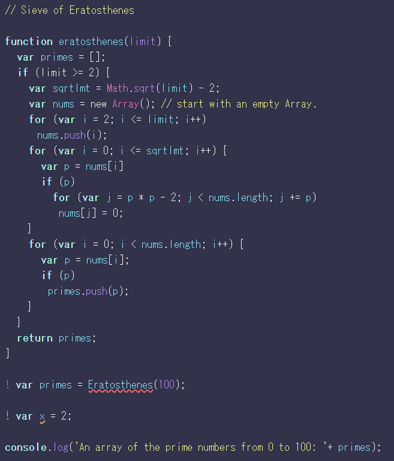
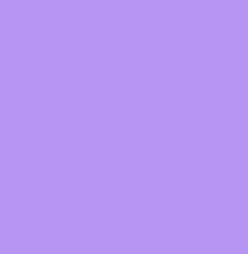
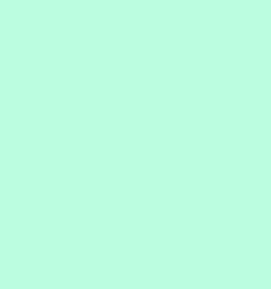
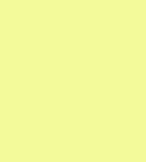
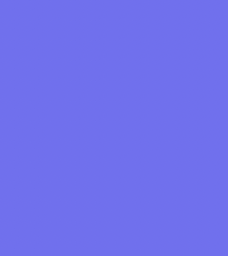
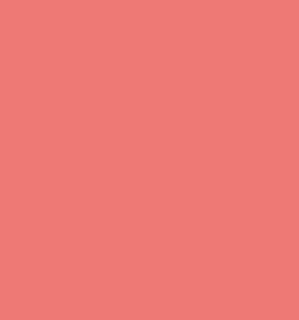
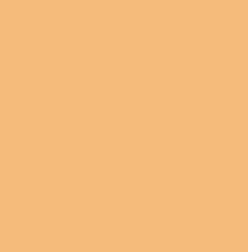

# Rain Theme

## Example

example javascript

## Install

WIP

## Color Palette

| Palette | Hex | RGB | Color |
|:-|:-|:-|:-|
| Background | `#32324b` | `50 50 75` |  |
| Foreground | `#f8f8f2` | `248 248 242` |  |
| Builtin | `#bd93f9` | `189 147 249` |  |
| Keyword | `#a8ffde` | `168 255 222` |  |
| String | `#f1fa8c` | `241 250 140` |  |
| Function Name | `#8be9fd` | `139 233 253` |  |
| Variable | `#8be9fd` | `139 233 253` |  |
| Type | `#ff79c6` | `255 121 198` |  |
| Constant | `#bd93f9` | `189 147 249` |  |
| Comment | `#f1fa8c` | `241 250 140` |  |
| Selection | `#7070f5` | `112 112 245` |  |
| Warning | `#ff7070` | `255 112 112` |  |
| Warning2 | `#ffb870` | `255 184 112` |  |

## License

[LICENSE](LICENSE) (c) gr1m0h
